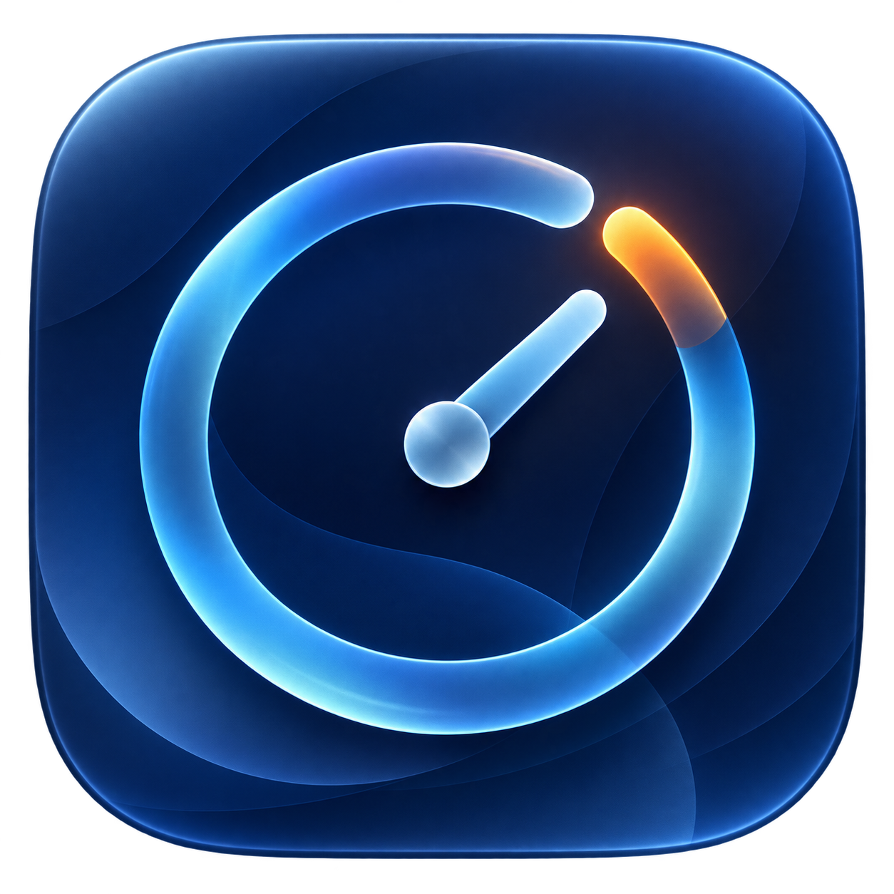

# CHRONOS

**Personal Time Intelligence** — understand where your time actually goes.



Chronos is a privacy-first macOS menu-bar app that converts event-driven application
activity into useful daily and weekly analytics. It distinguishes active use from
idle time and explains focus, interruption, and context-switch metrics without
screenshots, keystrokes, shame, or a required cloud account.

## V1 capabilities

- Event-driven application, screen, wake, and user-session tracking
- Idle-aware, crash-safe session reconstruction with local SQLite persistence
- Daily timeline, categories, focus sessions, context switches, and explainable score
- Weekly trends and a 14-day personal baseline
- Privacy Mode, application exclusions, category overrides, JSON export, and deletion
- Launch at Login, deterministic development history, and live energy diagnostics

## Architecture and privacy

Collection is driven by `NSWorkspace` notifications for applications, screen
state, device wake, and user sessions. A tolerant low-frequency idle check is the
only polling. Events and sessions remain in a local SQLite database.

See [Architecture](docs/ARCHITECTURE.md), [Privacy](docs/PRIVACY.md),
[Analytics](docs/ANALYTICS.md), and [Energy](docs/ENERGY.md).

## Requirements

- macOS 13 or later
- Swift 6 toolchain or Xcode 16+
- SQLite 3 (included with macOS)

The collector does not need Accessibility or Screen Recording permission. A future
optional enhanced mode may request additional permission only after explaining it.

## Development

```sh
swift build
swift test
swift run ChronosApp
swift run chronos-dev self-test
```

Build an ad-hoc signed app bundle for local installation:

```sh
./scripts/install-local.sh
```

The installer builds a hardened ad-hoc signed app, preserves the local SQLite
database, installs into `/Applications`, and launches Chronos. Complete onboarding
once to request modern macOS Launch at Login registration. The app starts as a
quiet menu-bar agent and opens no dashboard window automatically.

`chronos-dev self-test` verifies reconstruction, migration, transactional writes,
categorization, and analytics without launching the UI. Generate a realistic,
repeatable local dataset without touching the production database:

```sh
swift run chronos-dev generate --days 30 --seed 42
# writes .build/chronos-simulated.sqlite by default
```

## Roadmap

V1 is complete for local personal use. Later phases may add browser-domain context,
monthly correlations, routine discovery, cross-device collection, and optional
summary-only AI interpretation.

Phone sync, cloud accounts, and autonomous coaching are intentionally outside V1.
